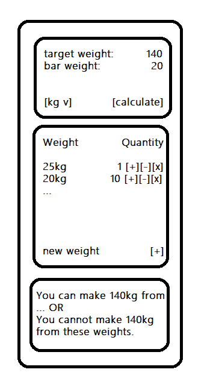
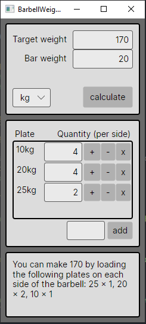

# Barbell Weight Calculator
A simple app for calculating which weight plates to put on a barbell to achieve a specific weight.

# Motivation

The purpose of this app is to **practice C# development**, specifically using the Avalonia UI framework.

It is intended to be a basic application that features:

* **Manual Model-View-ViewModel (MVVM) implementation** rather than using a framework (Reactive UI or Microsoft Community Toolkit)
  * Manually implementing MVVM will be more boilerplate, but requires a more intimate understanding of the pattern
* Simple **unit testing** using a plain old C# console application (separate project), rather than a framework
  * Again, the point is to test an understanding of basic concepts, which are not specific to any framework
* Data persistence/storage via JSON files written to disk (using a database would be overkill for an app of this size)

# Design

This project is small in scope, and so I will not use any project management software like Jira, Trello, or Notion. Instead, I will design the whole application upfront and simply implement it as I go along as nothing is expected to change. The requirements are as follows;

A user must be able to:

* Set a target weight
* Set the weight of the barbell, since there are different sizes (Olympic, trap bar, etc.)
* Set the weight unit i.e. kg or lbs. This doesn't effect the calculation, it's purely for display purposes
* Set which weight plates they have available, including adding plates, removing plates, and setting the quantity available of each plate
* See the result i.e. how they should load up the barbell OR a message displaying it's impossible if their current weight set cannot achieve it

The UI should look something like this (it's gorgeous, right? All jokes aside, **it's not supposed to look good**, this is just a proof of concept app and **the code is the focus**):

# Finished Product

TODO: embed a gif showing a demonstration of all app features.

